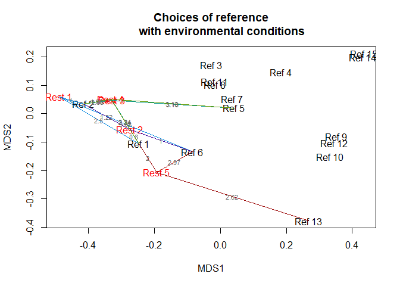

# ChooseRef
Functions for the Durbecq et al. paper (in prep) about ecosystem references


### How to install the package?

If not yet installed, you should install `devtools`:


```r
install.packages(devtools)
```

Load `devtools:


```r
library(devtools) 
```

Install package `ChoosRef`:


```r
install_github("RenaudJau/ChooseRef")
```

And load it:


```r
library(ChooseRef)
```


### How to use the functions?

Here is an example with the `dune` dataset from `vegan` package :


```r
library(vegan)
data("dune") #downloading of dune data (cf vegan)
data("dune.env") #downloading of dune.env data (cf vegan)
# keeping only the numeric variables :
dune.env <- data.frame(A1 = dune.env$A1, 
                       Moisture =  as.numeric(as.vector(dune.env$Moisture)),
                       Manure = as.numeric(as.vector(dune.env$Manure)))
                                          
# Creating a vector indicating which plots are the potential references and which ones are the restored sites
sites <- factor(c(rep("Rest",5),rep("Ref",15)))
# Creating a vector with the plot names
sites_names <- paste(sites,c(1:5,1:15))
#Poviding names to rows (useful for the outputs)
row.names(dune.env) <- sites_names
row.names(dune) <- sites_names
dune.envRest <- dune.env[sites=="Rest",]
dune.envRef <- dune.env[sites=="Ref",]
```

So your data.frame should look something like:

* Your restoration sites environmental data:

           A1   Moisture   Manure
-------  ----  ---------  -------
Rest 1    2.8          1        4
Rest 2    3.5          1        2
Rest 3    4.3          2        4
Rest 4    4.2          2        4
Rest 5    6.3          1        2

* Your potential references environmental data:

            A1   Moisture   Manure
-------  -----  ---------  -------
Ref 1      4.3          1        2
Ref 2      2.8          1        3
Ref 3      4.2          5        3
Ref 4      3.7          4        1
Ref 5      3.3          2        1
Ref 6      3.5          1        1
Ref 7      5.8          4        2
Ref 8      6.0          5        3
Ref 9      9.3          5        0
Ref 10    11.5          5        0
Ref 11     5.7          5        3
Ref 12     4.0          2        0
Ref 13     4.6          1        0
Ref 14     3.7          5        0
Ref 15     3.5          5        0

#### Calculating reference dissimilarities


```r
Distances <- DissRef3(RELEVES = dune.envRest, REF = dune.envRef, METHOD = "euclidean", DUPLICATES = FALSE)
Distances
```

```
## $Diss_Mean
## [1] 4.835113 3.672444 4.124837 4.133419 4.034573
## 
## $Diss_Min
## [1] 1.000000 0.800000 2.061553 1.989975 2.000000
## 
## $RelRef_order
##           X1     X2    X3    X4     X5     X6     X7     X8    X9    X10    X11
## Rest 1 Ref 2  Ref 1 Ref 6 Ref 5 Ref 12  Ref 4  Ref 3 Ref 13 Ref 7 Ref 11  Ref 8
## Rest 2 Ref 1  Ref 6 Ref 2 Ref 5 Ref 13 Ref 12  Ref 4  Ref 7 Ref 3 Ref 15 Ref 14
## Rest 3 Ref 2  Ref 1 Ref 5 Ref 3  Ref 7  Ref 6 Ref 11  Ref 8 Ref 4 Ref 12 Ref 13
## Rest 4 Ref 2  Ref 1 Ref 5 Ref 3  Ref 6  Ref 7 Ref 11  Ref 8 Ref 4 Ref 12 Ref 13
## Rest 5 Ref 1 Ref 13 Ref 6 Ref 7 Ref 12  Ref 5  Ref 2  Ref 4 Ref 8 Ref 11  Ref 3
##           X12    X13   X14    X15
## Rest 1 Ref 15 Ref 14 Ref 9 Ref 10
## Rest 2 Ref 11  Ref 8 Ref 9 Ref 10
## Rest 3 Ref 14 Ref 15 Ref 9 Ref 10
## Rest 4 Ref 14 Ref 15 Ref 9 Ref 10
## Rest 5 Ref 14 Ref 15 Ref 9 Ref 10
## 
## $DistRef_order
##              X1       X2       X3       X4       X5       X6       X7       X8
## Rest 1 1.000000 2.500000 3.080584 3.201562 4.294182 4.337050 4.354308 4.386342
## Rest 2 0.800000 1.000000 1.220656 1.428286 2.282542 2.291288 3.168596 3.780212
## Rest 3 2.061553 2.236068 3.162278 3.163858 3.201562 3.261901 3.458323 3.590265
## Rest 4 1.989975 2.238303 3.132092 3.162278 3.238827 3.249615 3.500000 3.638681
## Rest 5 2.000000 2.624881 2.973214 3.041381 3.207803 3.316625 3.640055 4.093898
##              X9      X10      X11      X12      X13      X14       X15
## Rest 1 4.690416 5.040833 5.219195 5.700000 5.728001 8.616844 10.377379
## Rest 2 4.182105 4.472136 4.476606 4.673329 4.821825 7.323933  9.165151
## Rest 3 3.655133 4.011234 4.134005 5.035871 5.063596 7.071068  8.765843
## Rest 4 3.640055 4.004997 4.142463 5.024938 5.048762 7.142129  8.848164
## Rest 5 4.134005 4.166533 4.627094 5.173007 5.276362 5.385165  6.858571
```

#### Plotting reference dissimilarities


```r
Diss_Ref_Plot(RELEVES = dune.envRest, REF = dune.envRef, DISTANCES = Distances, LINK_NUMBER = "N_REF", N_REF = 3)
```

```
## Wisconsin double standardization
## Run 0 stress 0 
## Run 1 stress 0.08464906 
## Run 2 stress 9.922329e-05 
## ... Procrustes: rmse 0.002397591  max resid 0.007459273 
## ... Similar to previous best
## Run 3 stress 9.756677e-05 
## ... Procrustes: rmse 0.003090233  max resid 0.01150618 
## Run 4 stress 9.895004e-05 
## ... Procrustes: rmse 0.00227069  max resid 0.005824004 
## ... Similar to previous best
## Run 5 stress 9.844966e-05 
## ... Procrustes: rmse 0.002864389  max resid 0.01019869 
## Run 6 stress 9.914384e-05 
## ... Procrustes: rmse 0.002394763  max resid 0.006688049 
## ... Similar to previous best
## Run 7 stress 9.829499e-05 
## ... Procrustes: rmse 0.003154837  max resid 0.01168793 
## Run 8 stress 0.08465458 
## Run 9 stress 9.897608e-05 
## ... Procrustes: rmse 0.003099266  max resid 0.01162378 
## Run 10 stress 9.53039e-05 
## ... Procrustes: rmse 0.002939981  max resid 0.0107298 
## Run 11 stress 9.992179e-05 
## ... Procrustes: rmse 0.002715703  max resid 0.009302149 
## ... Similar to previous best
## Run 12 stress 9.649792e-05 
## ... Procrustes: rmse 0.002896972  max resid 0.01046257 
## Run 13 stress 9.981622e-05 
## ... Procrustes: rmse 0.00189532  max resid 0.003900071 
## ... Similar to previous best
## Run 14 stress 0.1025332 
## Run 15 stress 9.893107e-05 
## ... Procrustes: rmse 0.002903545  max resid 0.01043569 
## Run 16 stress 9.810576e-05 
## ... Procrustes: rmse 0.002869621  max resid 0.01027793 
## Run 17 stress 9.327646e-05 
## ... Procrustes: rmse 0.002013238  max resid 0.004024682 
## ... Similar to previous best
## Run 18 stress 9.945486e-05 
## ... Procrustes: rmse 0.002669075  max resid 0.009363515 
## ... Similar to previous best
## Run 19 stress 8.549042e-05 
## ... Procrustes: rmse 0.003083912  max resid 0.01150259 
## Run 20 stress 9.72271e-05 
## ... Procrustes: rmse 0.003094111  max resid 0.01143379 
## *** Solution reached
```

<!-- -->

